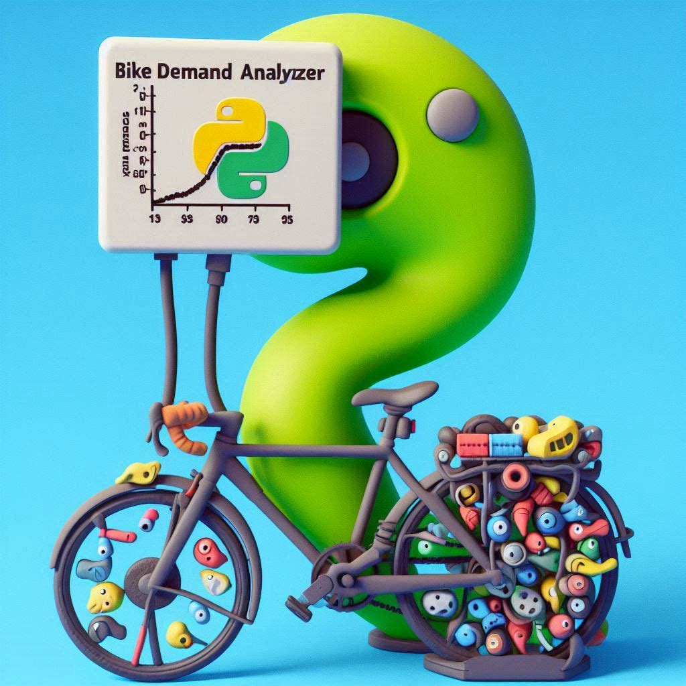

# 🚴 Bike Sharing Demand Prediction Regression Project

Welcome to the **ML Bike Sharing Demand Prediction Regression Project**! 🚲 This repository showcases a machine learning project aimed at predicting the demand for bikes in a bike-sharing system. Accurately forecasting bike demand helps optimize inventory and pricing strategies for bike rental companies, ensuring that bikes are always available when and where they're needed.

## 📊 Dataset Overview

The dataset used in this project was sourced from a bike-sharing company and contains a wealth of information, including:

- 🕒 **Date and Time**: Timestamp of each bike rental.
- 🌡️ **Weather Data**: Temperature, humidity, wind speed, and other relevant weather conditions.
- 🗓️ **Seasonality Factors**: Seasonal variations, holidays, and functioning/non-functioning days.

This rich dataset allows us to capture the various factors that influence bike rental demand, providing a robust foundation for our predictive model.

## 🛠️ Project Approach

Here's a high-level overview of how we approached this project:

### 1. **Data Preprocessing**
   - 🧹 Cleaned the dataset to handle missing values, outliers, and inconsistencies.
   - 🔄 Transformed features to better represent the underlying patterns.

### 2. **Data Splitting**
   - 🧪 Split the data into training and test sets to ensure unbiased model evaluation.

### 3. **Model Training**
   - 🧠 Experimented with various regression models and fine-tuned hyperparameters.
   - 📈 Trained models on the training data and evaluated their performance using key metrics.

### 4. **Model Evaluation**
   - 🏅 Assessed model performance using Mean Absolute Error (MAE), Root Mean Squared Error (RMSE), and R-squared (R²).
   - ✅ Selected the best-performing model for deployment.

### 5. **Feature Importance**
   - 🔍 Conducted ablation studies to understand the impact of individual features.
   - 🌡️ Identified key drivers of bike demand, such as temperature and weather conditions.

### 6. **Model Deployment**
   - 🚀 Deployed the final model in a live production environment.
   - 📊 Monitored its performance to ensure accurate real-time predictions.

## 🌟 Key Highlights

- **Accurate Predictions**: Our model achieves high accuracy, making it a valuable tool for bike-sharing companies.
- **Feature Insights**: We've gained a deep understanding of what drives bike demand, enabling more informed business decisions.
- **Scalable Solution**: The deployed model is ready to handle real-time data and provide actionable insights on the fly.

---

Feel free to explore the code and dive into the details of how we built and fine-tuned our bike demand prediction model. Contributions are welcome! 🚀
